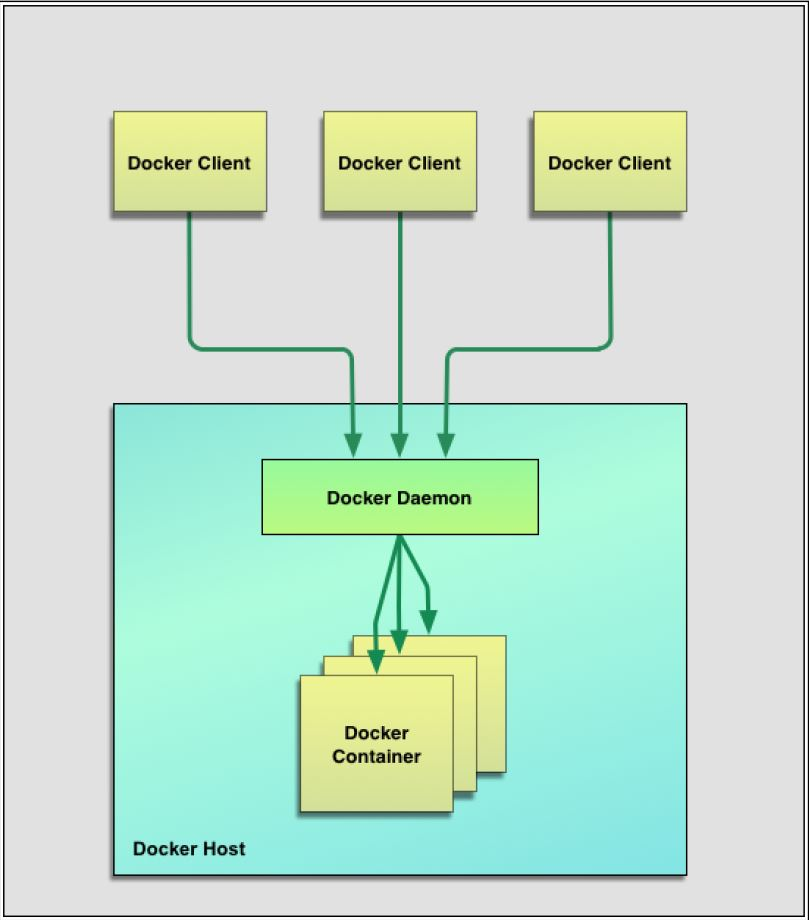
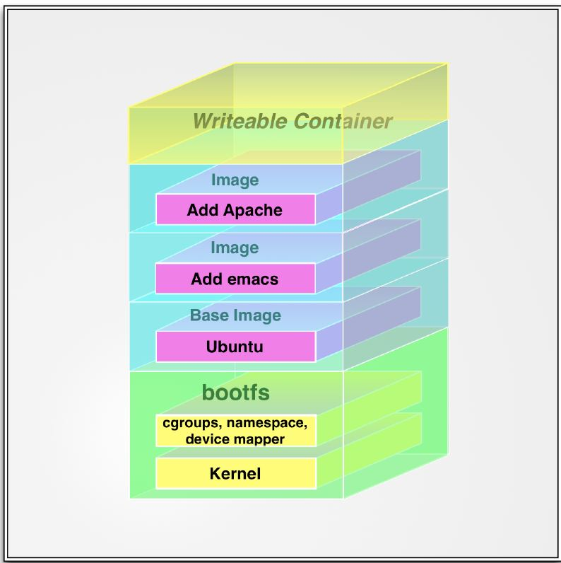

# Getting started with Docker 


## What is Docker ?

- Docker is an open-source engine that automates the deployment of applications into containers

- Written by the team at Docker, Inc

- You can get started with Docker on a minimal host running nothing but a compatible Linux kernel and a Docker binary.

- To run on Windows and Mac, you have to install Boot2Docker.

- Aims to make your applications portable, easy to build, and easy to collaborate on.

## Core Components of Docker

1. Docker client (Docker binary you install and run commands using it)

2. Docker server (Docker daemon )

3. Registries (Storage media of your Docker images)

4. Docker Containers (Instances of your Docker images)

## Docket architecture



## Docker images

- Images are the building blocks of the Docker world

- You launch your containers from images.

- They are a layered format, using Union file systems, that are built step-by-step using a series of instructions.

- Example of how a docker image is build from instaructions :

```

1. Add a file
2. Run a command
3. Open a port

```
- They are highly portable and can be shared, stored, and updated.

## Registries

- Docker stores the images you build in registries.

- Two types of registries:

	1. Public (like [DockerHub](https://hub.docker.com))

	2. Private 

- Images live inside repositories, and repositories live on registries. The default registry is the public registry managed by Docker, Inc., Docker Hub.	

## Containers

- Containers are launched from images and can contain one or more running processes.

- Docker borrows the concept of the standard shipping container, used to transport goods globally, as a model for its containers. But instead of shipping goods, Docker containers ship software.

## Building our first container

```
docker run -i -t ubuntu -name my_ubuntu_container /bin/bash
```

Now run following commands inside this container,

```
root@f7cbdac22a02:/# hostname
root@f7cbdac22a02:/# ls
root@f7cbdac22a02:/# apt-get install vim
```

#### To view list images locally

```
docker images
```
- These local images live on our local Docker host in the `/var/lib/docker` directory.

#### To view list of running containers

```
docker ps 
```

#### To view list of all containers (running , stopped and exited )

```
docker ps 
```

#### Seeing whats happening inside our container

```
docker logs <container_name>
```
- Use `-f` to tail logs

### Inspecting the container's processes

```
docker top <container_name>
```

### Finding out more about our container

```
docker inspect <container_name>
```

### Deleting a container

```
docker rm <container_name>
```

- use `-f` to force remove

### Docker Image filesystem

- Images can be layered on top of one another.
- The image below is called the parent image and you can traverse each layer until you reach the bottom of the image stack where the final image
is called the base image.
- Finally, when a container is launched from an image.
- Docker mounts a read-write filesystem on top of any layers below. This is where whatever processes we want our Docker container to run will execute.



### Searching for images

```
docker serach <image_name>
```
- You can also browse the available images online at Docker Hub.

Example:

```
# Seach for an image
docker search prateekjoshi

# Pull the image
docker pull prateekjoshi/spring-mvc-app
```

## Building our own images

- Two methods to build your own images:
	
	1) Using `docker commit` command

	2) Using `docker build` command with a Dockerfile

- **NOTE** :The docker commit method is not currently recommended, as building with a Dockerfile is far more flexible and powerful.	


### Building an image using `docker commit` 

1. Run a container from parent image

```
docker run -i -t debian:jessie /bin/bash
```

2. Do some changes on the running container

```
mkdir app_config
cd app_config
touch app.conf
```

3. Exit from the container using `exit` command

4. Now, we will create an image containing our app configuration files

```
docker commit <container_id> <name_of_image_to_create>
```

5. Run an instance of this new image created and verify the changes

```
docker run --name <container_name> -i -t <new_image_created> /bin/bash
```

### Building images with a Dockerfile

 1. Create a sample **Dockerfile**


	FROM ubuntu:14.04

	MAINTAINER Prateek Joshi "prateek@xyz.com"

	RUN apt-get update

	RUN apt-get install -y sysvbanner			

	ENTRYPOINT ["banner"]

	CMD ["Prateek"]


 2. Build your image using `docker build` command

 ```
 docker build --build-arg http_proxy=http://$http_proxy --build-arg https_proxy=http://$https_proxy -t banner_image .
 ```

 3. Run a container from the image you just created

 ```
 docker run --name <container_name> <image_name> "DOCKER"
 ```

 ## Using Docker for Testing, CI and CD : Runnning Jenkins on Docker

 1.Create a volume to mount which will hold your Jenkins data.

 ```
mkdir jenkins_data
cd jenkins_data
 ```
 2.Install and run Jenkins under Docker Container

 ```
docker run --name <container_name> -u root --rm -p 8080:8080 -p 50000:50000  -v `pwd`:/var/jenkins_home jenkins:latest

 ```

 3.Stop Jenkins container

 ```
 docker stop <container_name>
 ```

 4.Run a new instance of Jenkins container using same `jenkins_data` volume.

 ```
 docker run --name <container_name> -u root --rm -p 8080:8080 -p 50000:50000  -v `pwd`:/var/jenkins_home jenkins:latest
 ```

 5.We can see that we have a **PORTABLE** and **SCALABLE** jenkins server which can easily be backed up. 

## Dockerizing a Spring MVC Web Application


1.Clone the git repo

```
git clone https://github.com/PrateekJoshi/spring-mvc-app
```

2.Building the web app

```
./build.sh
```

3.Running the web app isnide a Docker container

```
`./run.sh
```

